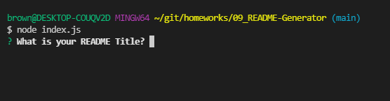
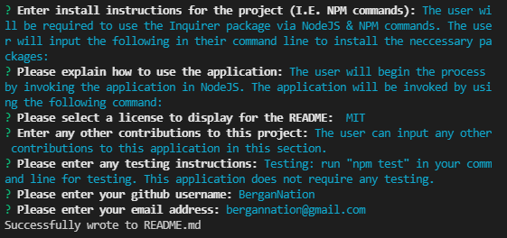

# 09_README Generator

## Your Task

When creating an open source project on GitHub, it’s important to have a high-quality README for the app. This should include what the app is for, how to use the app, how to install it, how to report issues, and how to make contributions&mdash;this last part increases the likelihood that other developers will contribute to the success of the project.

You can quickly and easily create a README file by using a command-line application to generate one. This allows the project creator to devote more time to working on the project.

Your task is to create a command-line application that dynamically generates a professional README.md file from a user's input using the [Inquirer package](https://www.npmjs.com/package/inquirer). Review the [Professional README Guide](https://coding-boot-camp.github.io/full-stack/github/professional-readme-guide) as a reminder of everything that a high-quality, professional README should contain.

The application will be invoked by using the following command:

```bash
node index.js
```

Because this application won’t be deployed, you’ll also need to provide a link to a walkthrough video that demonstrates its functionality. Revisit the Screencastify Tutorial in the prework as a refresher on how to record video from your computer. You’ll need to submit a link to the video _and_ add it to the README of your project.

## User Story

```md
AS A developer
I WANT a README generator
SO THAT I can quickly create a professional README for a new project
```

## Acceptance Criteria

```md
GIVEN a command-line application that accepts user input
WHEN I am prompted for information about my application repository
THEN a high-quality, professional README.md is generated with the title of my project and sections entitled Description, Table of Contents, Installation, Usage, License, Contributing, Tests, and Questions
WHEN I enter my project title
THEN this is displayed as the title of the README
WHEN I enter a description, installation instructions, usage information, contribution guidelines, and test instructions
THEN this information is added to the sections of the README entitled Description, Installation, Usage, Contributing, and Tests
WHEN I choose a license for my application from a list of options
THEN a badge for that license is added near the top of the README and a notice is added to the section of the README entitled License that explains which license the application is covered under
WHEN I enter my GitHub username
THEN this is added to the section of the README entitled Questions, with a link to my GitHub profile
WHEN I enter my email address
THEN this is added to the section of the README entitled Questions, with instructions on how to reach me with additional questions
WHEN I click on the links in the Table of Contents
THEN I am taken to the corresponding section of the README
```

## Table of Contents

If your README is long, add a table of contents to make it easy for users to find what they need.

- [Links to Application](#Links)
- [Mock-Up](#Mock-Up)
- [Install](#installation)
- [Usage](#usage)
- [Questions](#questions)
- [Credits](#credits)

## Links

Below are links to access this live website and repository.

Github: https://github.com/bergannation/09_README-Generator

Google Drive Video Link for Sample README: https://drive.google.com/file/d/12Ix3CWBtpRMCw2Tot2nN-WT3iw9L12jh/view

## Mock-Up

The following image shows the web application's appearance and functionality:


## Installation

The user will be required to use the Inquirer package via NodeJS & NPM commands. The user will input the following in their command line to install the neccessary packages:

```md
npm i
```

## Usage

The user will begin the process by invoking the application in NodeJS. The application will be invoked by using the following command:

```md
node index.js
```




Once the user has inputted the information he wishes to have for each question, the README is generated with the title of my project and sections entitled Description, Table of Contents, Installation, Usage, License, Contributing, Tests, and Questions.



To view a finished final product of the application, view the sampleREADME.md file. Below is a gif of a sample final product.


## Questions

Here is a link to my github for more information: [Github]: https://github.com/BerganNation

You can reach me with any additional questions by email: BerganNation@gmail.com

Video Link: https://drive.google.com/file/d/12Ix3CWBtpRMCw2Tot2nN-WT3iw9L12jh/view
