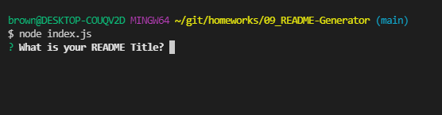
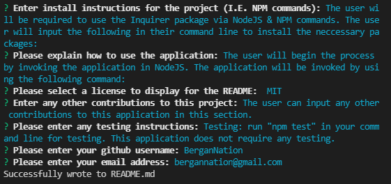

# High-Quality README Generator


## Table of Contents

- [Description](#description)

- [Install](#installation)

- [Usage](#usage)

- [License](#license)

- [Contributing](#contributing)

- [Tests](#tests)

- [Questions](#questions)

## Description

It is important to have a high-quality README for the app. This should include what the app is for, how to use the app, how to install it, how to report issues, and how to make contributions. You can quickly and easily create a README file by using a command-line application to generate one. This allows the project creator to devote more time toworking on the project. This project will show and describe on how to do just that.  
 

## Installation

The user will be required to use the Inquirer package via NodeJS & NPM commands. The user will input the following in their command line to install the neccessary packages:

```md
npm i
```

## Usage

The user will begin the process by invoking the application in NodeJS. The application will be invoked by using the following command:

```md
node index.js
```





## Contributing

The user can input any other contributions to this application in this section.

## Tests

Testing: run "npm test" in your command line for testing. This application does not require any testing.

## Questions

Here is a link to my github for more information: [Github]: https://github.com/BerganNation

You can reach me with any additional questions by email: BerganNation@gmail.com

Video Link: https://drive.google.com/file/d/12Ix3CWBtpRMCw2Tot2nN-WT3iw9L12jh/view

## License

This project is brought to you with a Apache license.
